<div align="center">

<!-- ========================================================================= -->
<!-- 🌌 MODULE 00: PRIMARY TELEMETRY & SYSTEM INITIALIZATION                  -->
<!-- ========================================================================= -->



<br><br>

<!-- OS STATUS BAR -->
<p>
  <code><b>OS_KERNEL:</b> v4.19-COSMOS</code> &nbsp;•&nbsp; 
  <code><b>CLEARANCE:</b> LEVEL-5 [ROOT]</code> &nbsp;•&nbsp; 
  <code><b>NODE:</b> ORBIT_0x7E3</code> &nbsp;•&nbsp; 
  <code><b>STATUS:</b> <span style="color:#a9e2d4">ACTIVE ●</span></code>
</p>

<!-- TACTICAL BADGES -->
<p>
  <a href="https://github.com/justavenoir"></a>
  
  
</p>


</div>

<!-- ========================================================================= -->
<!-- 🛸 MODULE 01: OPERATOR IDENTITY & BIOMETRIC AUTH                          -->
<!-- ========================================================================= -->

### `┌── [ MOD-01 // OPERATOR_IDENTITY ] ──────────────────────────────────────────┐`



<br>

<div align="center">
  <table width="100%">
    <tr>
      <td align="center">
        <b>MISSION DIRECTIVE:</b> <i>"Learn how it works. Understand how it breaks. Build it better. Secure it."</i>
      </td>
    </tr>
  </table>
</div>


<!-- ========================================================================= -->
<!-- 🛰️ MODULE 02: SYSTEM DIRECTIVES & DEFENSE MATRIX                         -->
<!-- ========================================================================= -->

### `┌── [ MOD-02 // CORE_DIRECTIVES & SPECIALIZATIONS ] ─────────────────────────┐`

```text
               ┌──────────────────────────────────────────────┐
               │         AVENOIR CYBER DEFENSE MATRIX         │
               └──────────────────────┬───────────────────────┘
                                      │
            ┌─────────────────────────┼─────────────────────────┐
            │                         │                         │
            ▼                         ▼                         ▼
   [ OFFENSIVE RESEARCH ]    [ SECURE ENGINEERING ]    [ RESILIENT SYSTEMS ]
   • Binary Analysis         • Zero-Trust Design       • Fault Tolerance
   • Vulnerability Audit     • Cryptographic Hygiene   • Linux Hardening
   • Threat Modeling         • Code Review & Testing   • Automated Monitoring
            │                         │                         │
            └─────────────────────────┼─────────────────────────┘
                                      │
                                      ▼
                        [ BUILD SECURELY & DEFEND ]
```

| Sector | Core Vector | Mission Profile |
| :--- | :--- | :--- |
| 🛡️ **Cybersecurity** | Threat Analysis & Auditing | Auditing system surfaces, analyzing threat vectors, and hardening environments. |
| 🔐 **Secure Development** | Clean & Defensive Code | Designing zero-trust architectures in Python & C++ that resist exploitation. |
| 📱 **Native Client UX** | Cross-Platform Engineering | Engineering robust, beautiful client-side telemetry applications with Flutter & Dart. |
| 🐧 **Infrastructure** | Linux & Unix Internals | Deep command-line mastery, shell automation, kernel telemetry, and system monitoring. |


<!-- ========================================================================= -->
<!-- 🪐 MODULE 03: TACTICAL ARSENAL & TECH STACK                              -->
<!-- ========================================================================= -->

### `┌── [ MOD-03 // TACTICAL_ARSENAL & WEAPONRY ] ───────────────────────────────┐`

<div align="center">

<p><b>CORE COMPUTATION ENGINES & LOW-LEVEL SYSTEMS</b></p>


<br><br>

<p><b>FRAMEWORKS, RUNTIMES & OPERATIONAL ENVIRONMENTS</b></p>


<br><br>

<p>
  
  
  
  
</p>

</div>


<!-- ========================================================================= -->
<!-- 📡 MODULE 04: THREAT RADAR & TELEMETRY SUBSYSTEM                          -->
<!-- ========================================================================= -->

### `┌── [ MOD-04 // LIVE_RADAR & THREAT_SCANNER ] ───────────────────────────────┐`




<!-- ========================================================================= -->
<!-- ⚡ MODULE 05: CALIBRATED SKILL MATRIX                                     -->
<!-- ========================================================================= -->

### `┌── [ MOD-05 // SKILL_CALIBRATION_MATRIX ] ──────────────────────────────────┐`




<!-- ========================================================================= -->
<!-- 📊 MODULE 06: ORBITAL TELEMETRY & GITHUB ACTIVITY                         -->
<!-- ========================================================================= -->

### `┌── [ MOD-06 // ORBITAL_TELEMETRY & GITHUB_DATA ] ───────────────────────────┐`

<div align="center">


<br><br>


</div>


<!-- ========================================================================= -->
<!-- 🚀 MODULE 07: ACTIVE OPERATIONS & PROJECT MANIFEST                        -->
<!-- ========================================================================= -->

### `┌── [ MOD-07 // MISSION_MANIFEST & ACTIVE_OPS ] ─────────────────────────────┐`

```text
╭─ 🌌 MISSION MANIFEST // DEEP_SPACE_DEVELOPMENT ───────────────────────────╮
│                                                                           │
│  [OP-01]  STARLIGHT-ENTROPY // TRUE COSMIC QUANTUM KEY GENERATOR          │
│           Harvests cryptographic entropy from celestial photon noise      │
│           Status: 🟢 OPERATIONAL & DEPLOYED (NIST SP 800-90B Compliant)   │
│           Repo  : https://github.com/justavenoir/starlight-entropy        │
│                                                                           │
│  [OP-02]  SECURE SOFTWARE FRAMEWORK                                       │
│           Core: Python / C++ • Architecture: Zero-Trust Modular Engine    │
│           Status: ⚙️ ACTIVE SPRINT & THREAT AUDIT                          │
│                                                                           │
│  [OP-03]  CROSS-PLATFORM TELEMETRY SUITE                                  │
│           Core: Flutter / Dart • Focus: High-Security Client Dashboard    │
│           Status: 📱 IN ADVANCED PROTOTYPING                              │
│                                                                           │
│  ─── ALL REPOSITORIES TRANSMITTING ON GITHUB FREQUENCY ─────────────────  │
╰───────────────────────────────────────────────────────────────────────────╯
```

<div align="center">

<a href="https://github.com/justavenoir?tab=repositories">
  
</a>

</div>


<!-- ========================================================================= -->
<!-- 💫 MODULE 08: TERMINAL INTERFACE & INFINITE LOOP                          -->
<!-- ========================================================================= -->


